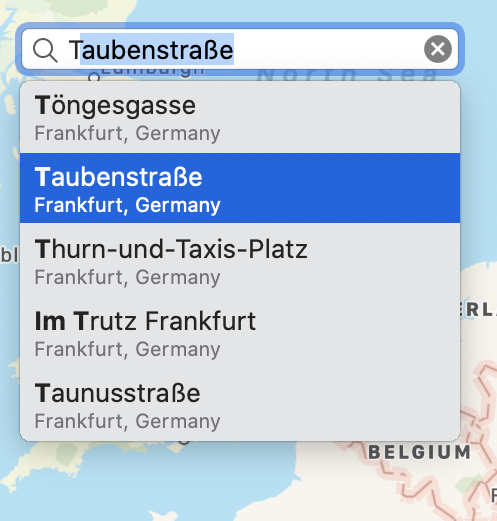

# SuggestionPopup

[](https://opensource.org/licenses/lgpl-3.0)

This is a suggestion popup implementation similar to the one used by the `Maps.app` on macOS 10.15. It is provided under the GNU Lesser General Public License v3.0. I only tested it on macOS 10.15, 11.0. MacOS 10.13-10.14 could work. I will test this in the future and make it compatible, if required. This software is still in beta.



Usage:    
If you just want to have a simple location search, things are easy:

``` Swift
// Keep a reference to the search completer in memory.
var searchCompleter: LocationSearchCompleter!
...
// Somewhere in your constructor create a LocationSearchCompleter with 
// your textField. You can still use the textField delegate !
self.searchCompleter = LocationSearchCompleter(searchField: searchField)
self.searchCompleter.onShow = { ... }
self.searchCompleter.onHide = { ... }
self.searchCompleter.onHighlight = { ... }
self.searchCompleter.onSelect = { ... }
```

If you want a custom search, things are a little bit more difficult. 

``` Swift
// Create or implement a new class based on NSObject which conforms
// to the `Suggestion` protocol. A simple new class could look like 
// this: 
class SimpleSuggestion: NSObject, Suggestion {
    init(title: String = "", subtitle: String = "", image: NSImage? = nil) {
        self.title = title
        self.subtitle = subtitle
        self.image = image
    }

    var title: String = ""
    var subtitle: String = ""
    var image: NSImage?
    var highlightedTitleRanges: [Range<Int>] = []
    var highlightedSubtitleRanges: [Range<Int>] = []
}
// Most of the times it might be easier to just extend your existing class.
// Take a look at the `LocationSearchCompleter` to see a simple example.


// Create a new subclass of the SearchCompleter class
class SimpleSearchCompleter: SearchCompleter {

	// This is called on `init`. It is just for your convenience.
	// Place all initial setup code here. 
	override func setup() {
	
	}

	// Override this function to prepare your search. If your search 
	// is compute intensive, use a background thread here and call
	// `setSuggestions` on completion. You might show a progress spinner
	// in this case. For a simple search, just place your code here 
	// and end the function with a `setSuggestions` call.
	override func prepareSuggestions(for searchString: String) {
		//self.showSpinner()
		super.prepareSuggestions(for: searchString)
	}
  
	// Call this function to show the search result. You might override
	// it to hide the progress spinner.
	override func setSuggestions(_ suggestions: [Suggestion]) {
		//self.hideSpinner()
		super.setSuggestions(suggestions)
	}
}
``` 
